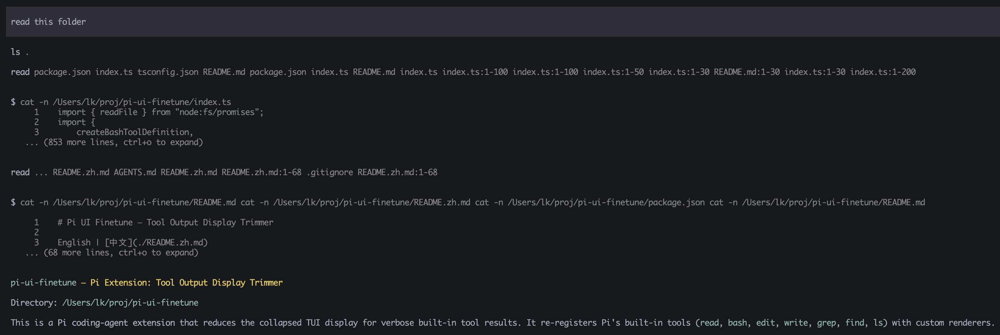

# Pi UI Finetune — Tool Output Display Trimmer

English | [中文](./README.zh.md)

A [Pi](https://github.com/badlogic/pi-mono) extension that reduces the collapsed
TUI display for verbose built-in tool results.

## Screenshot



## Installation

```bash
pi install npm:pi-ui-finetune
# Then launch pi
pi
```

Or copy `index.ts` to `~/.pi/agent/extensions/` for auto-discovery.

## Configuration

All settings are optional.

```bash
# Tools whose collapsed display should be trimmed.
# Default: all built-in tools: read,bash,edit,write,grep,find,ls
PIUF_SUPPRESSED_TOOLS=read,bash,edit,write,grep,find,ls

# Number of output lines considered visible in Pi's normal collapsed preview.
# The hint reports total output lines minus this number. Default: 5
PIUF_COLLAPSED_VISIBLE_LINES=5

# Number of bash output lines shown before the collapsed hint. Default: 3
PIUF_BASH_PREVIEW_LINES=3

# Enable debug logging (default: false)
PIUF_DEBUG=false
```

The extension also reads these variables from a local `.env` file. Real
environment variables take precedence over `.env` values.

## More Extensions

- [tab-follow-up](https://github.com/lollipopkit/pi-tab-follow-up): Use <kbd>Tab</kbd> instead of <kbd>Alt</kbd>+<kbd>Enter</kbd> to trigger follow-up input.
- [pi-models-metadata](https://github.com/lollipopkit/pi-models-metadata): Register provider models with metadata enrichment.
